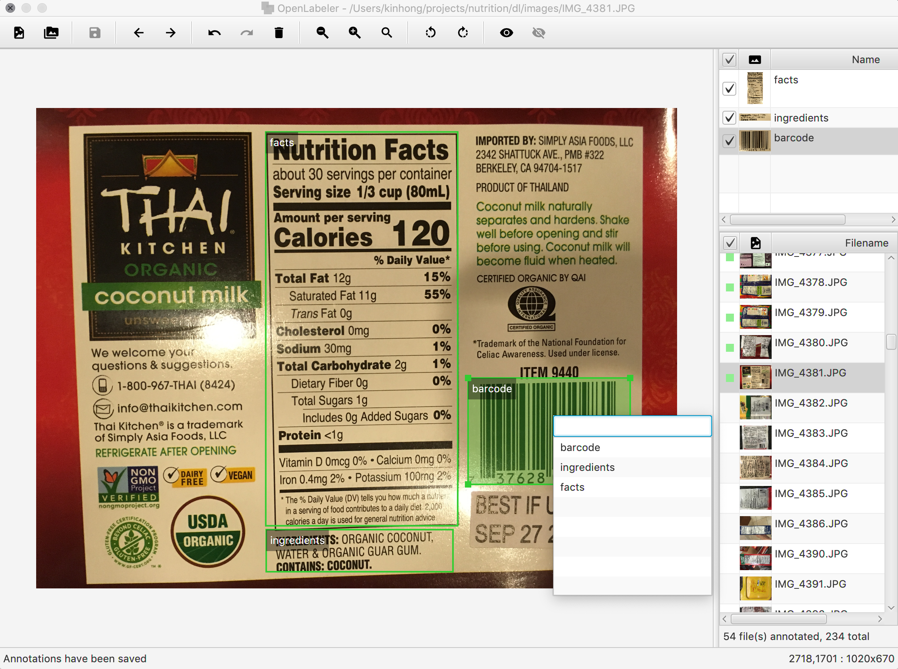
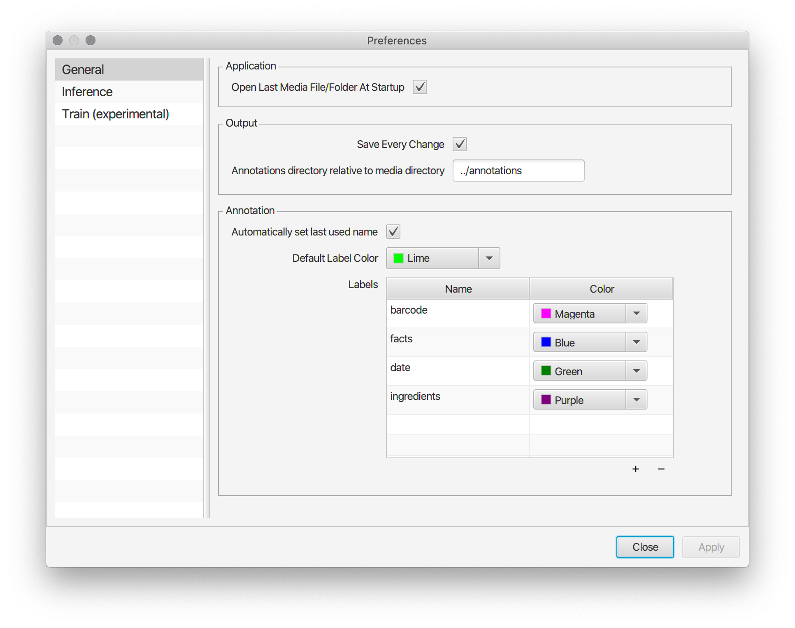
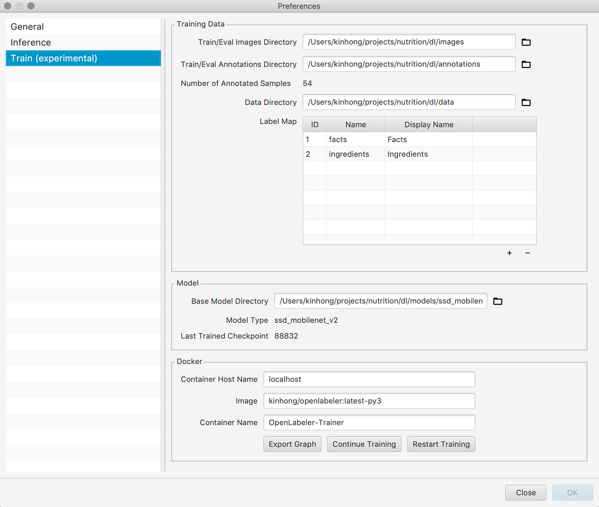

# OpenLabeler
[](https://raw.githubusercontent.com/kinhong/openlabeler/master/LICENSE)
[](https://github.com/kinhong/openlabeler/releases/)

## Introduction

**OpenLabeler** is an open source application for annotating objects. It can generate the PASCAL VOC format XML annotation file for artificial intelligence and deep learning training. A unique aspect of this application is its ability to use inference (with [TensorFlow](https://www.tensorflow.org)) to help improve accuracy and speed up the annotation process.

OpenLabeler is written in [OpenJDK](https://openjdk.java.net)/[OpenJFX](https://openjfx.io) (version 11.x).



A few highlights:

* Fast Labeling (no need for Open/Save File actions)

* Multi-level undo/redo
* Annotation "hints" (using TensorFlow inference) 
* Pre-built installation packages for macOS (tested on macOS Mojave), Linux (tested on Ubuntu 18.04 LTS), and Windows (tested on Windows 10 Pro)

## Inference

OpenLabeler can help improve the speed and accuracy of annotation by providing labeling "hints" from a saved model using TensorFlow.

For example, you have thousands of images to annotate. After labeling the first 300 or so images, you could train a model using these 300 samples, then configure OpenLabeler to use this intermediary model to give you labeling suggestions for the remaining images, thereby speeding up the annotation task.


The **Label Map File** is the label map file in protobuf format (`.pbtxt`).

The **Saved Model Location** is the *folder* where the `.pb` file is located. If it is at `/opt/model/saved_model/saved_model.pb`, then the location should be specified as `/opt/model/saved_model`. Also, the `.pb` file must be named `saved_model.pb`.

## Training Support

*Note: This is currently an experimental feature.*

OpenLabeler can be used to start/stop a training process in TensorFlow within a [Docker](https://www.docker.com) container. Containers with [TensorFlow](https://www.tensorflow.org/install/docker) and [Object Detection API](https://github.com/tensorflow/models/tree/master/research/object_detection) dependencies have been pre-built for your convenience. To use this feature:

1. [Install Docker](https://docs.docker.com/install) on your host machine
2. Choose a pre-built, `kinhong/openlabeler:latest-py3` or `kinhong/openlabeler:latest-gpu-py3`, [docker image](https://cloud.docker.com/repository/docker/kinhong/openlabeler/tags) from [Docker Hub](https://hub.docker.com/) and pull it to your docker host
3. Download a base model from the [TensorFlow Detection Model Zoo](https://github.com/tensorflow/models/blob/master/research/object_detection/g3doc/detection_model_zoo.md) for transfer learning
4. Configure the Training Preference settings (and add the label map entries)

5. You can then start, stop, continue, restart training, or export the inference graph

## Shortcut Keys

The following shortcut keys are supported:

| Key Combination  | Action
| ------------- | -------------
| Ctrl (or ⌘) + o | Open media file
| Ctrl (or ⌘) + d | Open media directory
| Ctrl (or ⌘) + s | Save changes
| Ctrl (or ⌘) + x | Cut
| Ctrl (or ⌘) + c | Copy
| Ctrl (or ⌘) + v | Paste
| ⌫ (Backspace or Delete)  | Delete selected box
| Ctrl (or ⌘) + p | Go to previous media file
| Ctrl (or ⌘) + n | Go to next media file
| Ctrl (or ⌘) + g | Go to next unlabeled media file
| Ctrl (or ⌘) + h | Show inference hints
| Ctrl (or ⌘) + Shift + h | Hide inference hits
| Ctrl (or ⌘) + z | Undo
| Ctrl (or ⌘) + Shift + z | Redo
| Ctrl (or ⌘) + ↑→↓← (Arrow Keys) | Move selected bounding box  
| Any character(s) | Match/change label by prefix (on recent labels) of the selected box 


## Installation

If you have previously installed OpenLabeler, uninstall it first.

Download and execute the `.pkg`, `.deb` or `.msi` installation packages for macOS, Linux, and Windows respectively on the [releases](https://github.com/kinhong/OpenLabeler/releases) page.

## Recommended Directory Structure
```
+project
  +images
  +annotations
  +data
    -label_map file
    -train TFRecord file
    -eval TFRecord file
  +models
    +model
      -pipeline config file
      +train
        -saved_model
```
 
## Build

This application can be built using [Apache Maven](https://maven.apache.org).

### macOS

1. Download and install [OpenJDK 11](http://jdk.java.net/11)
2. Download and install [Maven](https://maven.apache.org/install.html)
```
cd <openlabeler>
mvn clean install
```
The macOS .pkg installer can be found under the app/target/package directory.

### Linux
```
sudo add-apt-repository ppa:openjdk-r/ppa \
sudo apt-get update -q \
sudo apt install -y openjdk-11-jdk

sudo apt-get install maven

sudo apt-get install fakeroot

cd <openlabeler>
mvn clean install
```
The Linux .deb bundle can be found under the app/target/package directory.

### Windows

1. Download [OpenJDK 11+](http://jdk.java.net/11/) for Windows and unzip to a directory with no spaces (e.g., `C:\java\jdk-11`)
2. Download [Maven](https://maven.apache.org/download.cgi) and unzip to a directory with no spaces (e.g., `C:\java\apache-maven`)
3. Download [Wix](https://github.com/wixtoolset/wix3/releases) and unzip to a directory with no spaces (e.g., `C:\wix`)
3. Open Control Panel > System and Security > System. Set the `PATH` (e.g., `C:\java\jdk-11\bin;C:\java\apache-maven\bin;C:\wix\bin`) and `JAVA_HOME` (e.g., `C:\java\jdk-11`) environment variables

```DOS .bat
cd <openlabeler>
copy <openlabeler>\bin\jdk.packager-windows\jpackager.exe <java_home>\bin
copy <openlabeler>\bin\jdk.packager-windows\jdk.packager.jar <java_home>\jmods
mvn clean install
```

The Windows .msi file can be found under the app\target\package directory.

## License

[Apache License 2.0](LICENSE.md)
